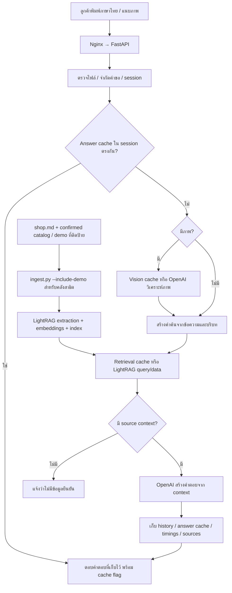

# ลำดับตอบคำถาม

```mermaid
flowchart TD
    A[ลูกค้าพิมพ์ภาษาไทย / แนบภาพ] --> B[Nginx → FastAPI]
    B --> C[ตรวจไฟล์ / จำกัดคำขอ / session]
    C --> D{Answer cache ใน session ตรงกัน?}
    D -- ใช่ --> Z[ตอบคำตอบที่เก็บไว้ พร้อม cache flag]
    D -- ไม่ --> E{มีภาพ?}
    E -- มี --> F[Vision cache หรือ OpenAI วิเคราะห์ภาพ]
    E -- ไม่มี --> G[สร้างคำค้นจากข้อความและบริบท]
    F --> G
    G --> H[Retrieval cache หรือ LightRAG query/data]
    H --> I{มี source context?}
    I -- ไม่มี --> J[แจ้งว่าไม่มีข้อมูลยืนยัน]
    I -- มี --> K[OpenAI สร้างคำตอบจาก context]
    K --> L[เก็บ history / answer cache / timings / sources]
    L --> Z
    M[shop.md + confirmed catalog / demo ที่ติดป้าย] --> N[ingest.py --include-demo สำหรับคลังสาธิต]
    N --> O[LightRAG extraction + embeddings + index]
    O --> H
```

นี่คือลำดับที่เตรียมไว้ในโค้ด ยังไม่ใช่หลักฐานว่า OpenAI / LightRAG ทำงานจริง ดู stack-audit.md สำหรับสถานะปัจจุบัน
